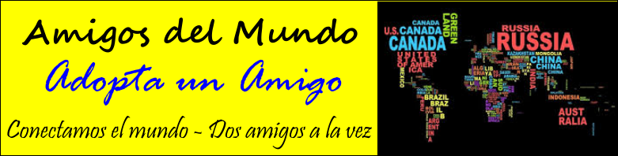
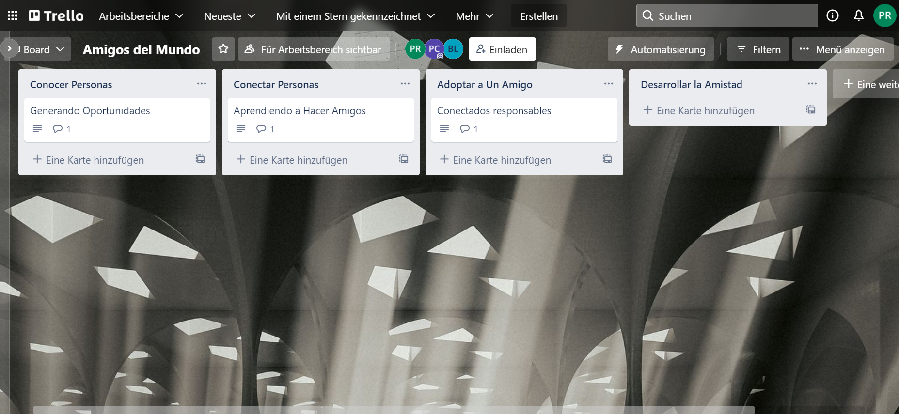
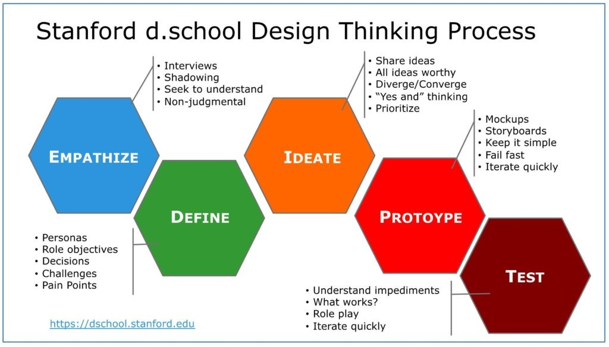

# AmigosDelMundo
Un sitio para presentar nuestra OnlineComunidad - los Amigos del Mundo! Conectamos el mundo.

Proyecto de Inteligencia Colectiva y Formación en la Empresa 
[Master en Gestión y Tecnologías de Procesos de Negocio](https://masteres.ugr.es/mbagestiontic/)
ETS Ingeniería Informatica y de Telecomunicación Univesidad de Granada  

----

**Titulo** : Amigos Del Mundo

**Autor(es)** : Bin Liu, Plácido Omar Córcega Caraballo, Polina Rajko

**Resumen** : ¿Te sientes un poco perdido? ¿Y quieres hablar con personas del todo el mundo? ¿Te gustaría conocer gente, formar amistades y aprender sobre otros países en el mundo del Covid? ¡Nosotros lo hacemos posible! 
Nosotros somos el equipo "Amigos Del Mundo" y nuestro objetivo es conectar gente. Nosotros queremos hacer posible conectar con gente en este tiempo duro y crear amistades para toda la vida.
Si tenéis ganas de aprender - sobre gente, países, culturas - y crear amistades internacionales - "Amigos del Mundo" es vuestra solución.

**Logotipo** :

**Slogan** : Conectamos el mundo - dos amigos a la vez.

**Hashtag**  #ConnectTheWorld; #AmigosDelMundo; #AmigosInternacionales; #Conectate

**Licencia** : CC (probablemente, pero tiene que ser revisado)   (usar una creative commons: revisar en https://creativecommons.org/licenses/?lang=es_ES) 

**Fecha** : 01/2022

**Medios** : Instagram, Twitter, Twitch, Discord

*  :octocat: https://github.com/Palinkara/AmigosDelMundo 
* Twitter 
* ... 

---

### Nuestra misión y historia
Cuando nos hemos encontrado en nuestro grupo, fuimos un poco perdido. ¿Qué proyecto hacemos? ¿Qué comunidad podemos crear y qué valor podemos dar a la sociedad? Mucho tiempo hemos pasado juntos sin saber eso. Hasta... hasta el momento cuando hemos hecho un pequeño juego de asociación. ¿Lo que hemos encontrado jugandolo? Somos todos muy idealistas, queremos cambiar el mundo y ayudar la gente. Además somos un equipo muy internacional - Asia, Latino America, Europa - tenemos tres continentes en nuestro equipo.

Y basado en hesto hemos comenzado a discutir que podemos hacer. ¿Qué se puede hacer con un equipo tan internacional, tan motivado, tan idealista? 

Nuestra respuesta: Queremos conectar gente. No sabemos si nosotros nos conocimos sin la UGR, sin este Máster, sin la posibilidad de venir a clases y aprender y trabajar juntos. ¿Pero ahora? Ahora podemos compartir nuestros conocimientos, podemos compartir nuestras culturas y discutir en multiples idiomas.
Nos gusta mucho.
Pero en pensando qué suerte hemos tenido, no podíamos no pensar en gente que no puede hacer eso:
La gente que no puede viajar por la pandemia, la gente que no sabe o no puede crear amistades internacionales (en la vida real o por la Red).
Y eso nos ha dado la idea:
¿Por qué no crear una aplicación que hace todo eso posible? ¿Una aplicación para conocer gente del todo el mundo, una aplicación para compartir los eventos en su vida y aprender sobre las vidas de otros, puede ser en otro país?

Y eso es lo que nos ha ayudado a crear lo que tenemos ahore:
La comunidad virtual "Amigos Del Mundo", una comunidad que, como decimos nostros, "conecta el mundo - dos amigos a la vez".

Muchas gracias por su atención.

---

### Descripción

Creo que todos nosotros conocemos la situación - queremos crear amigos internacionales, conectarnos con el mundo y aprender (también, pero ¡no sólo sobre idiomas y culturas!), pero no funciona. 
No porque no intentamos - estamos seguros que todos nos que buscamos conocer gente estamos muy activos en las Redes Sociales - pero porque... porque no funciona, porque no hay conexiones entre vosotros que son más que "quiero conocer gente de otros países".
¡No es así con "Amigos del Mundo"!

En nuestra comunidad cada uno puede - y tiene que - decir desde el primer momento que le interesa. 
¿Bailar, nadar, hacer esgrima? ¿Puede ser que te gusta ir al cine o jugar ajedrez?
¡No te preocupes! Aquí tenemos lo todo:
El momento que escoges tus intereses nuestra comunidad te muestre quién tiene interesas iguales o parecidos - y puedes hablar con ellos desde el primer momento.
También tenemos canales grupales dónde gente que tiene un interés en común puede discutirlo.

No sólo puedes encontrar gente fácilmente - encuentras amigos.
Amigos que comparten tus intereses.
Amigos que te pueden enseñar palabras que necesitas de verdad. 
(No como algunos libros que piesan que "Yo quiero hablar con el caballo" es más importante que hablar sobre tu hobby favorito.)
Amigos que puedes adoptar y que te adoptan.

---

### Acerca de nostros
Vale, ahora vos hemos explicado qué es la nuestra misión, de dónde proviene nuestra idea y qué es nuestro objetive - para nosotros y el mundo.
¿Pero quién somos? 
Nuestro equipo consiste de Bin Liu, Plácido Omar Córcega Caraballo y Polina Rajko y nos hemos encontrado en el Máster de Gestión y Tecnologías de Procesos de Negocio de la Universidad de Granada.
Desde el primer momento sabimos que somos un equipo muy internacional, con muchos intereses y un objetivo común: Aprender más sobre el mundo y las culturas.
En nuestro caso hemos decidido de "compartir" el mundo entre nosotros tres:
Bin Liu es de Asia, Plácido de la America Latina y Polina de Europa.
Basado en eso hemos comenzado ha pensar cómo crear nuestra comunidad y hemos visto, que ya tenemos todo lo que necesitamos:
A Bin Liu le gusta programar, a Plácido le gusta el aprendizaje y aprender sobre el aprendizaje y a Polina le gusta escribir y conectar con gente.

Después de compartir las responsabilidades, no se quedó much a planificar:
Hemos comenzado con la creación de nuestra Comunidad. ¿Y ahora?
Ahora estamos aquí y podemos presentaros que hemos creado:
Una comunidad que va a conectar el mundo y dar la posibilidad de intercambiarse, de compartir y de aprender.

¡Conectamos el mundo todos juntos!

--- 

### Metodología

Metodología de desarrollo: Diseño de contenidos digitales mediante estrategia de diseño de Experiencias de usuario (UX experiences) 

Actividades realizadas mediante Trello https://trello.com/b/Gs27Lido

### Etapa 1: Ideación de proyecto 

La Ideación (o mejor: Los cinco pasos de Design Thinking) se han hecho en la clase presencial de la asignatura 24: "Inteligencia colectiva y la formación en las empresas".

El documento puede encontrarse en: [Aquí](Proyecto.25.ene.pdf)

Ese paso hemos hecho durante la clase, directamente después de decidir sobre de quién va a consistir nuestro grupo. 
En este momento ya nosotros más o menos conocimos, pero teníamos ni idea sobre los intereses y hobbies de los otros.
Por eso hemos comenzado con una pequeña traducción: Cada uno tenía que explicar qué hace (estudia y/o trabaja), qué intereses tiene y qué relación y experiencia tiene con las redes sociales.
Lo que hemos visto desde el primer momento fue que nadie en nuestro grupo es español. Aunque todos hablamos la misma idioma, nadie de nostros es español o de Granada. Y también otra cosa que todos nosotros teníamos en común - a nos tres nos gusta muchísimo viajar y conocer otras culturas y gente.
Basado en esto - en el primer paso decidimos que queremos hacer "algo internacional" y "algo para conocer gente y culturas".
En el primer paso eso fue todo que teníamos.

**Investigación de campo (Desk research propuestas inspiradoras para el proyecto)**

Nuestra Investigación consistió de multiples partes:
Hemos comenzado con lo que sabíamos sobre redes sociales y gente parecida a nosotros.
Por ejemplo sabíamos que probablemente hay gente en el mundo que quiere viajar y no lo puede (por el Covid, por no tener bastante dinero, por el miedo de no ser entendido...).
También sabíamos que ya existen diferentes redes sociales para conectar gente: Conocíamos todos Facebook, o WeChat, o Tandem, o HelloTalk, y muchos más.
En ese momento hemos pensado sobre cómo nosotros podemos diferenciarnos - cómo podemos ser innovativos y interesantes en un mondo donde reina Facebook.
Para eso hemos utilizado métodos diferentes - hemos utilizado un Business Model Canvas, los sombreros de pensar, hemos creado una persona con sus necesidades y deseos.
También hemos pensado sobre que siente o quiere una persona hoy en día y hemos creado una Experience Map.
Basado en uso fuimos capable de encontrar ideas nuevas y posibilidades de diferenciarnos.

Todos los documentos que he nombrado se pueden encontrar [Aquí](Proyecto.25.ene.pdf).

Pero en el siguiente vamos a trabajar por grandes partes con el Business Model Canvas, porque es muy intuitivo y contiene todos los informaciones que necesitamos.

**Necesidad/oportunidad** 

**Motivación de la propuesta** .... ¿ por qué consideras interesante ? 

**Personas/Usuarios**  (...¿en quién piensas que puede ser útil ? ¿cual es tu publico objetivo?) 

### Etapa 2: Prototipar / productos 

(Productos que has desarrollado y como se plantea la integración de los diferentes medios, pon los que uses) 

* Imagen visual (Portada / Diseño de Interfaz) y herramienta usada 

* redes sociales (...) 

* publicidad: banner (... ) 

* ...

### Etapa 3: Técnicas de evaluación utilizadas

(Estrategia que plantearías para evaluar tu propuesta, medidodes e indicadores de éxito, elige / propone) 

* Test con usuarios (...) 
* ... 

### Conclusiones y trabajo futuro

* Grado de consecución del proyecto 
* Problemas identificados  (técnicos / sobre la idea inicial / planificacion… ) 
* Propuestas de mejora (por qué consideras que merece la pena continuar)
* Posible interés del proyecto (¿ Quien podría  colaborar / involucrarse en el proyecto? ¿viable?)

Referencias y recursos: 

* Artículos ..  
* Productos utilizados  
* Propuestas de mejora

(...)

----

**Referencias y recursos utilizados** :

* [Proceso UX](https://uxmastery.com/resources/process/)
* [Diseño de Experiencias UX](http://www.nosolousabilidad.com/articulos/uxd.htm) 
* [Métodos UX](https://mgea.github.io/UX-DIU-Checklist/index.html) 
* [MuseMap: ejemplo de experiencia UX](https://blog.prototypr.io/musemap-street-art-app-ux-case-study-9bec6a99823b) 
* (...) 

(...)
* (Artículos ..  )
* (Productos utilizados ) 
* (Recursos tipo Imágenes, videos , etc.) 
