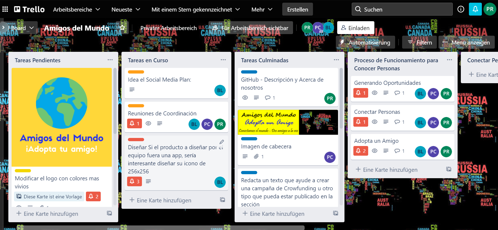

# AmigosDelMundo
Un sitio para presentar nuestra OnlineComunidad - los Amigos del Mundo! Conectamos el mundo.

Proyecto de Inteligencia Colectiva y Formación en la Empresa 
[Master en Gestión y Tecnologías de Procesos de Negocio](https://masteres.ugr.es/mbagestiontic/)
ETS Ingeniería Informatica y de Telecomunicación Univesidad de Granada  

----

**Titulo** : Amigos Del Mundo

**Autor(es)** : Bin Liu, Plácido Omar Córcega Caraballo, Polina Rajko

**Resumen** : ¿Te sientes un poco perdido? ¿Y quieres hablar con personas del todo el mundo? ¿Te gustaría conocer gente, formar amistades y aprender sobre otros países en el mundo del Covid? ¡Nosotros lo hacemos posible! 
Nosotros somos el equipo "Amigos Del Mundo" y nuestro objetivo es conectar gente. Nosotros queremos hacer posible conectar con gente en este tiempo duro y crear amistades para toda la vida.
Si tenéis ganas de aprender - sobre gente, países, culturas - y crear amistades internacionales - "Amigos del Mundo" es vuestra solución.

**Logotipo** :

**Slogan** : Conectamos el mundo - dos amigos a la vez.

**Hashtag**  #ConnectTheWorld; #AmigosDelMundo; #AmigosInternacionales; #Conectate

**Licencia** : CC (probablemente, pero tiene que ser revisado)   (usar una creative commons: revisar en https://creativecommons.org/licenses/?lang=es_ES) 

**Fecha** : 01/2022

**Medios** : Instagram, Twitter, Twitch, Discord

*  :octocat: https://github.com/Palinkara/AmigosDelMundo 
* Twitter 
* Instagram: https://www.instagram.com/_amigosdelmundo_/

---

### Nuestra misión y historia
Cuando nos hemos encontrado en nuestro grupo, fuimos un poco perdido. ¿Qué proyecto hacemos? ¿Qué comunidad podemos crear y qué valor podemos dar a la sociedad? Mucho tiempo hemos pasado juntos sin saber eso. Hasta... hasta el momento cuando hemos hecho un pequeño juego de asociación. ¿Lo que hemos encontrado jugandolo? Somos todos muy idealistas, queremos cambiar el mundo y ayudar la gente. Además somos un equipo muy internacional - Asia, Latino America, Europa - tenemos tres continentes en nuestro equipo.

Y basado en hesto hemos comenzado a discutir que podemos hacer. ¿Qué se puede hacer con un equipo tan internacional, tan motivado, tan idealista? 

Nuestra respuesta: Queremos conectar gente. No sabemos si nosotros nos conocimos sin la UGR, sin este Máster, sin la posibilidad de venir a clases y aprender y trabajar juntos. ¿Pero ahora? Ahora podemos compartir nuestros conocimientos, podemos compartir nuestras culturas y discutir en multiples idiomas.
Nos gusta mucho.
Pero en pensando qué suerte hemos tenido, no podíamos no pensar en gente que no puede hacer eso:
La gente que no puede viajar por la pandemia, la gente que no sabe o no puede crear amistades internacionales (en la vida real o por la Red).
Y eso nos ha dado la idea:
¿Por qué no crear una aplicación que hace todo eso posible? ¿Una aplicación para conocer gente del todo el mundo, una aplicación para compartir los eventos en su vida y aprender sobre las vidas de otros, puede ser en otro país?

Y eso es lo que nos ha ayudado a crear lo que tenemos ahore:
La comunidad virtual "Amigos Del Mundo", una comunidad que, como decimos nostros, "conecta el mundo - dos amigos a la vez".

Muchas gracias por su atención.

---

### Descripción

Creo que todos nosotros conocemos la situación - queremos crear amigos internacionales, conectarnos con el mundo y aprender (también, pero ¡no sólo sobre idiomas y culturas!), pero no funciona. 
No porque no intentamos - estamos seguros que todos nos que buscamos conocer gente estamos muy activos en las Redes Sociales - pero porque... porque no funciona, porque no hay conexiones entre vosotros que son más que "quiero conocer gente de otros países".
¡No es así con "Amigos del Mundo"!

En nuestra comunidad cada uno puede - y tiene que - decir desde el primer momento que le interesa. 
¿Bailar, nadar, hacer esgrima? ¿Puede ser que te gusta ir al cine o jugar ajedrez?
¡No te preocupes! Aquí tenemos lo todo:
El momento que escoges tus intereses nuestra comunidad te muestre quién tiene interesas iguales o parecidos - y puedes hablar con ellos desde el primer momento.
También tenemos canales grupales dónde gente que tiene un interés en común puede discutirlo.

No sólo puedes encontrar gente fácilmente - encuentras amigos.
Amigos que comparten tus intereses.
Amigos que te pueden enseñar palabras que necesitas de verdad. 
(No como algunos libros que piesan que "Yo quiero hablar con el caballo" es más importante que hablar sobre tu hobby favorito.)
Amigos que puedes adoptar y que te adoptan.

---

### Acerca de nostros
Vale, ahora vos hemos explicado qué es la nuestra misión, de dónde proviene nuestra idea y qué es nuestro objetive - para nosotros y el mundo.
¿Pero quién somos? 
Nuestro equipo consiste de Bin Liu, Plácido Omar Córcega Caraballo y Polina Rajko y nos hemos encontrado en el Máster de Gestión y Tecnologías de Procesos de Negocio de la Universidad de Granada.
Desde el primer momento sabimos que somos un equipo muy internacional, con muchos intereses y un objetivo común: Aprender más sobre el mundo y las culturas.
En nuestro caso hemos decidido de "compartir" el mundo entre nosotros tres:
Bin Liu es de Asia, Plácido de la America Latina y Polina de Europa.
Basado en eso hemos comenzado ha pensar cómo crear nuestra comunidad y hemos visto, que ya tenemos todo lo que necesitamos:
A Bin Liu le gusta programar, a Plácido le gusta el aprendizaje y aprender sobre el aprendizaje y a Polina le gusta escribir y conectar con gente.

Después de compartir las responsabilidades, no se quedó much a planificar:
Hemos comenzado con la creación de nuestra Comunidad. ¿Y ahora?
Ahora estamos aquí y podemos presentaros que hemos creado:
Una comunidad que va a conectar el mundo y dar la posibilidad de intercambiarse, de compartir y de aprender.

¡Conectamos el mundo todos juntos!

--- 

### Metodología

Metodología de desarrollo: Diseño de contenidos digitales mediante estrategia de diseño de Experiencias de usuario (UX experiences) 

Actividades realizadas mediante Trello https://trello.com/b/Gs27Lido/amigos-del-mundo

### Etapa 1: Ideación de proyecto 

La Ideación (o mejor: Los cinco pasos de Design Thinking) se han hecho en la clase presencial de la asignatura 24: "Inteligencia colectiva y la formación en las empresas".

El documento puede encontrarse en: [Aquí](Proyecto.25.ene.pdf)

Ese paso hemos hecho durante la clase, directamente después de decidir sobre de quién va a consistir nuestro grupo. 
En este momento ya nosotros más o menos conocimos, pero teníamos ni idea sobre los intereses y hobbies de los otros.
Por eso hemos comenzado con una pequeña traducción: Cada uno tenía que explicar qué hace (estudia y/o trabaja), qué intereses tiene y qué relación y experiencia tiene con las redes sociales.
Lo que hemos visto desde el primer momento fue que nadie en nuestro grupo es español. Aunque todos hablamos la misma idioma, nadie de nostros es español o de Granada. Y también otra cosa que todos nosotros teníamos en común - a nos tres nos gusta muchísimo viajar y conocer otras culturas y gente.
Basado en esto - en el primer paso decidimos que queremos hacer "algo internacional" y "algo para conocer gente y culturas".
En el primer paso eso fue todo que teníamos.

**Investigación de campo (Desk research propuestas inspiradoras para el proyecto)**

Nuestra Investigación consistió de multiples partes:
Hemos comenzado con lo que sabíamos sobre redes sociales y gente parecida a nosotros.
Por ejemplo sabíamos que probablemente hay gente en el mundo que quiere viajar y no lo puede (por el Covid, por no tener bastante dinero, por el miedo de no ser entendido...).
También sabíamos que ya existen diferentes redes sociales para conectar gente: Conocíamos todos Facebook, o WeChat, o Tandem, o HelloTalk, y muchos más.
En ese momento hemos pensado sobre cómo nosotros podemos diferenciarnos - cómo podemos ser innovativos y interesantes en un mondo donde reina Facebook.
Para eso hemos utilizado métodos diferentes - hemos utilizado un Business Model Canvas, los sombreros de pensar, hemos creado una persona con sus necesidades y deseos.
También hemos pensado sobre que siente o quiere una persona hoy en día y hemos creado una Experience Map.
Basado en uso fuimos capable de encontrar ideas nuevas y posibilidades de diferenciarnos.

Todos los documentos que he nombrado se pueden encontrar [Aquí](Proyecto.25.ene.pdf).

Pero en el siguiente vamos a trabajar por grandes partes con el Business Model Canvas, porque es muy intuitivo y contiene todos los informaciones que necesitamos.

**Necesidad/oportunidad** 

Analizando las necesidades y oportunidades hemos visto, que con la fronteras cerradas, con las restricciones de contacto y generalmente con el Covid, hay muchísima gente que se siente sola. No se puede encontrarse como antes, especialmente en países donde las restricciones obligan la gente a reducir el contacto con otra gente y salir lo menos posible.
También sabemos que en muchos casos o la frontera con otros países está cerrada o que la gente no tiene el dinero para trabajar, pero depende del lugar, viajar puede ser muy caro.
Pero el humano queda siendo una creatura social para sentirse bien y tener una buena salud mental.

Por esto hemos decidido de crear nuestra Comunidad.
Ahora se puede preguntar que nos hace tan especial que la gente elige nosotros en vez de por ejemplo Facebook.
Eso es muy fácil a explicar porque nosotros queremos centrarnos en dos cosas:

1. Queremos ser internacional y vamos a dar toda la ayuda posible para facilitar el contacto entre países y culturas. Vamos a incluir moderatores multilinguas que saben manejar problemas de idiomas y van a ayudar si haya malentendidos en algunos casos.
2. Queremos conectar gente con intereses parecidos. Por eso hemos dicho que cada uno debe incluir por lo menos un interés cuando entra en la comunidad para que nosotros podemos ayudarle encontrar gente con intereses parecidos.

Eso va a diferenciar nosotros de otras plataformas que a) no se centran en la internacionalidad y/o b) no ayudan a la gente encontrar gente con intereses parecidos, y eso va a ser nuestra fortaleza y posibilidad.

**Motivación de la propuesta**

Como ya descrito - la motivación principal en este proyecto es que a nosotros nos gustaría mucho participar en una comunidad como la que hemos creado. 
Nosotros estámos agradecidos de tener la posibilidad de estar y estudiar al extranjero, en Granada, y de conocer gente y idiomas. También sabemos que muchísima gente sólo no tiene esa posibilidad - ellos no pueden viajar porque les falta dinero, conocimientos y porque las fronteras de sus países están cerradas.
Porque nosotros queremos compartir la posibilidad que tenemos, hemos pensado de crear "Amigos Del Mundo".
Así la gente puede conectarse desde su casa, hablar con gente del otro parte del mundo y adoptar amigos.

**Personas/Usuarios**  (...¿en quién piensas que puede ser útil ? ¿cual es tu publico objetivo?) 

### Etapa 2: Prototipar / productos 

Antes de comenzar con el prototipado, definimos un diseño general.
Para eso hemos utilizado el diseño del prototipo que teníamos un poco más temprano que el resto y por el cual hemos obtenido una muy buena reacción.

Nuestro logotipo (que se puede encontrar en la explicación de arriba) consiste en un fondo amarillo que atrae atención, incluye el mundo (porque queremos mostrar que nosotros hacemos posible conectar el mundo) y dos textos: "Amigos del Mundo" (el nombre de nuestra comunidad) y "Adopta tu amigo" (nuestro slogan). 
Además hemos decidido añadir un azúl oscuro porque tiene un contrasto muy bonito con el amarillo.

También - de la perspectiva psícologica - nos gusta que así tenemos un color muy activador (el amarillo) y un color que da calma (el azúl) en un lugar.
El blanco y el negro que también utilizamos en algunos casos son neutral.

Basado en eso también hemos creado la cabezera (también se puede encontrar en la explicación de arriba) y un moodboard.

* Imagen visual (Moodboard) y Canvas

El moodboard fue creado con las plantillas de Canva y imagenes de Pixabay (no necesitan atribución).

* Icono

También hemos creado un icono para compartir la aplicación en diferentes lugares.
Eso icono es basado en la tierra del logotipo y muestra que vamos a conectar el mundo.

#### Protocolo:
Hace mucho tiempo que el mundo eliminó la distancia entre las personas que viven en todo el mundo a través de la tecnología, pero la sensación de distancia en los corazones de las personas es el mayor distanciamiento.
Aunque el mundo se ha inundado con una gran cantidad de software social, tales problemas aún existen, y los prejuicios y la desconfianza siguen siendo los principales problemas en la relación. 
Por las razones anteriores, nuestro grupo tiene la intención de crear una comunidad experimental. Nos centraremos principalmente en la positividad del contenido y la armonía de la comunidad.Esto da como resultado una mejor experiencia para los usuarios de la comunidad.Nuestro valor proviene de reunir a los usuarios más positivos y mostrarlos en la comunidad.

#### El Valor de nuestro proyecto
1. Nuestro contenido es en base de los disntintos interes de usuario y sus deseos de que quiere producir mas relacion con el mundo mas grande y positivo.
2. Nos ofrecemos un plataforma que hay un ambiente armoniso. los sentimientos de confianza y aceptacion es  mas  importante
3. Usuario de diferentes regiones,culturas,edad... al aspecto mas importante es la mayoria de ellos son receptivos.Esto es propicio para la formación de valor comunitario.

#### Objetivo directo
Inevitablemente tenemos que interactuar con sitios web y aplicaciones con propiedades similares. Pero nuestro objetivo principal es que cuando una persona quiera conectarse más con otras personas sobre un tema determinado, entre en nuestra comunidad.

#### Estrategia Futura
1.	Crearemos diferentes categorías de módulos según las diferentes necesidades de los usuarios y sus propias condiciones e intereses.El boca a boca de una comunidad en la etapa inicial puede determinar su entorno futuro (qué tipo de personas fluirán y su impacto en la comunidad)
2.	No queremos tener un gran número de clientes al principio, lo que nos quitará la posibilidad de optimizar al máximo en un tiempo limitado.Atraeremos más personal técnico y community managers a medida que crezca el número.
3.	Dada la gran cantidad de canales diferentes y el lento tiempo de producción de contenido de calidad, nuestra etapa inicial atraerá a más usuarios que estén dispuestos a comentar.
4.	Al mismo tiempo, no queremos que esta comunidad solo chatee y pase el tiempo.Por eso en el canal correspondiente, invitaremos a algunos profesionales para que den algunas orientaciones sobre el contenido y la dirección.
5.	Cree desafíos de cuestionarios y registros de actividad en los usuarios del canal correspondiente para aumentar el entusiasmo y la lealtad de los usuarios.
6.	Cree tantos emojis e interacciones como sea posible para permitir que los usuarios se comuniquen entre idiomas.

#### Publicidad
Debido a la naturaleza de la comunidad, generalmente no brindamos publicidad explícita, pero brindamos productos cuidadosamente seleccionados en función del contenido de cada canal y la aceptación del usuario.Los productos colocados de esta manera serán relativamente precisos y los usuarios los aceptarán más fácilmente. Las categorías de productos deben relacionarse con el contenido de nuestra comunidad, deben ser productos que los usuarios estén interesados y necesiten.

#### Unas ideas complementarias

1.	Coopere con algunas plataformas educativas para introducir algunos cursos, después de todo, esta no es solo una comunidad de comunicación, sino que todos necesitan aprender más sobre lo que les interesa.
2.	Damos bienvenida e invitamremos algunas personas influyentes a experimentar nuestra comunidad y marque especialmente sus identidades después de que ingresen a la comunidad.
3.	No se tolerará la discriminación ni el comportamiento ilgal.Reclamación de derechos de autor sobre el contenido del usuario
4.	Los contribuyentes activos al tema correspondiente y los más populares votados por todos son recompensados y alentados con invitaciones a eventos.

#### Plan de social media

### Misión
Hacer que las personas del mundo puedan encontrar verdaderos amigos y conectarlos con personas de otras latitudes, para satisfacer su necesidad de compañía mediante la interacción permanente en la práctica de principios y valores como el amor, la honestidad, el respeto de manera que sean resilientes, fuertes, que se ayuden a descubrir su identidad y su propósito de vida, impulsando la salud mental a través de renovación del entendimiento.

### Objetivos:
1. Incrementar el conocimiento de nuestra comunidad digital (marca) a través de nuestra página web para que sea reconocida por los usuarios que buscan amistades verdadera y suplan su necesidad de soledad.
2. Generar comunidad en redes sociales: Desarrollar la comunidad digital sólida en las redes sociales, promoviendo participación masiva de interrelaciones de calidad e iteraciones permanentes.
3. Generar tráfico a la página web mediante la gestión SEO que nos permita posicionarnos en los principales motores de búsqueda y en las redes sociales.
4. Provocar amistades genuinas y duraderas mediante las iteraciones de las interrelaciones personales permanentes de ususarios que anhelan cubrir su necesidad de compañía.

En un principio lo promocionaremos en la Universidad de Granada, porque nuestros compañeros también son de todo el mundo, ya través de sus ensayos y sugerencias optimizaremos aún más la comunidad.
Al mismo tiempo, estableceremos cuentas oficiales en las principales aplicaciones sociales para promocionar nuestro contenido. Nuestro sitio web también utiliza herramientas de SEO para llamar la atención.
El comienzo de la comunidad fue difícil porque había muchas aplicaciones similares y algunas aplicaciones sociales formaban un monopolio.
Cómo hacer que nuestra comunidad sea reconocible será un tema importante, presentaremos el intercambio de diferentes regiones y culturas, y al mismo tiempo con funciones sociales básicas. Preferimos crear una red de relaciones cooperativas con otras aplicaciones de diferentes categorías. Al mismo tiempo, establezca la identidad social en el proceso de servir a los usuarios, para esperar que su propia comunidad gane una buena reputación.

### Etapa 3: Técnicas de evaluación utilizadas

(Estrategia que plantearías para evaluar tu propuesta, medidodes e indicadores de éxito, elige / propone) 

* Test con usuarios (...) 
* ... 

### Conclusiones y trabajo futuro

#### Campaña de Crowdfunding

Los desarrollaremos en ocho pasos:

En primer lugar, aprender todos los detalles y escenarios que se contemplan en una campaña de financiación colectiva “Crowdfunding” estudiando los materiales impartidos en clases y otros artículos especializados. Además, de entrevistar y aprender de otros que han tenido experiencias anteriores.

En segundo lugar, Planificación del Proyecto, definir los objetivos, alcances, metas y las fases del proyecto de la comunidad digital “Amigos del Mundo”. Asimismo, la visión, misión, el monto a recaudar, costes y recompensas, identificar las tareas y delegar entre los socios, integrantes de la comunidad digital “Amigos del Mundo” cada tarea.

En tercer lugar, una vez generado el proyecto determinar el mensaje y hacer una precampaña con vídeos, emisiones en directo en todas las redes sociales, por correo electrónico, apoyándome en nuestra lista de contactos, amigos, compañeros de estudios, de trabajo, docentes, y familiares para redistribuir el enlace de las promoción.

En cuarto lugar, iniciar la precampaña y aplicar el plan de promoción de la idea de negocio y del producto a desarrollar. En esta fase se requiere crear confianza en el público captado mediante la precampaña para despertar en ellos el interés y ganarlos como potenciales donantes del proyecto.

En quinto lugar, se pretende establecer vínculos con las nuevas personas para un futuro cercano iniciar un proceso de fidelización y mantenerlos informados. (personalización).

En sexto lugar, elaborar un plan de entrevistas con los medios de comunicación masiva, programas de Tv, radio, prensa escrita para presentar la idea de negocio, recompensas y anunciar fecha de lanzamiento.

En septimo lugar, iniciar la campaña propiamente dicha, con la experiencia de la precampaña corregir los errores cometidos y agregar las estrategias que se consideren deben incluirse e ir evaluando las metas financieras, reforzar con material multimedia y lista de contacto para reenviar los enlaces de la campaña hasta qiue finalice la campaña.

En octavo lugar, reunión de evaluación con los socios, informar y agradecer a todos los donantes de las metas alcanzadas, entregar las recompensas, publicar a los medios de comunicación masiva y hacer lo propio en las redes sociales de los resultados obtenidos y de los pasos que se seguirán.

* Grado de consecución del proyecto 
* Problemas identificados  (técnicos / sobre la idea inicial / planificacion… ) 
* Propuestas de mejora (por qué consideras que merece la pena continuar)
* Posible interés del proyecto (¿ Quien podría  colaborar / involucrarse en el proyecto? ¿viable?)

### Landing Page

https://github.com/PCorcega/AmigosMundo-2122-ICFE

https://pcorcega.github.io/AmigosMundo-2122-ICFE/

### Presentación y vídeo

Última cosa que hemos hecho en este tiempo:
Nosotros hemos creado una presentación.

La presentación (en PDF) [Aquí](Amigos%20del%20Mundo.pdf)
.

Y el vídeo está [Aquí](Amigos%20del%20Mundo%20-%201.mp4)

Referencias y recursos: 

* Artículos ..  
* Productos utilizados  
* Propuestas de mejora

(...)

----

**Referencias y recursos utilizados** :

* [Proceso UX](https://uxmastery.com/resources/process/)
* [Diseño de Experiencias UX](http://www.nosolousabilidad.com/articulos/uxd.htm) 
* [Métodos UX](https://mgea.github.io/UX-DIU-Checklist/index.html) 
* [MuseMap: ejemplo de experiencia UX](https://blog.prototypr.io/musemap-street-art-app-ux-case-study-9bec6a99823b) 
* (...) 

(...)
* (Artículos ..  )
* (Productos utilizados ) 
* (Recursos tipo Imágenes, videos , etc.) 
